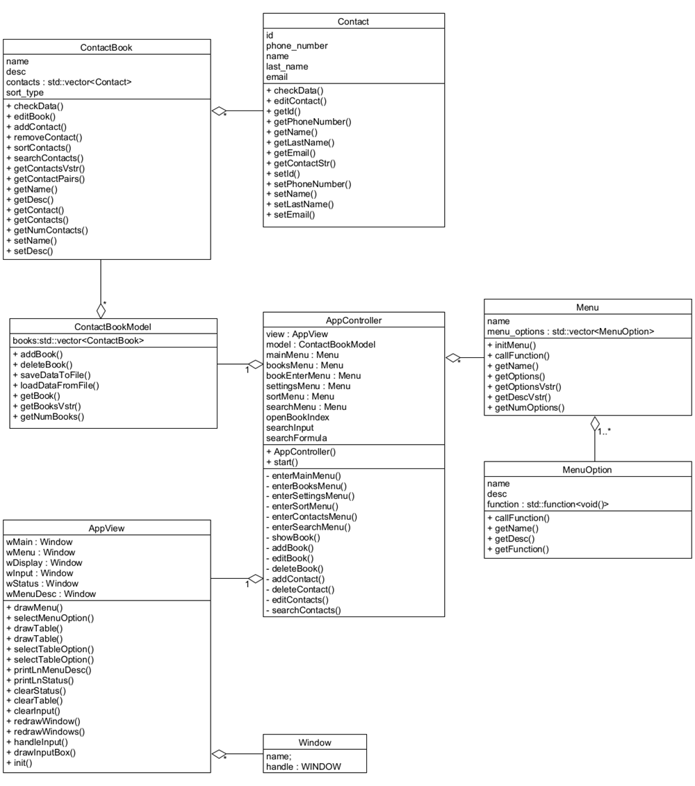

# Contact-Manager

A simple project for university. More attention was given to creating clear documentation using the Doxygen tool.

The main objective of the application was to implement the MVC pattern, introduce a clear user interface, and to implement the appropriate algorithms to ensure that the project meets the requirements given to the project group.

# UML Class Diagram

# User Interface

## Authors

- Tomasz Wojtasek
- Paweł Kurek
  
[Paper Documentation (.pdf)](Paper Docs.pdf)