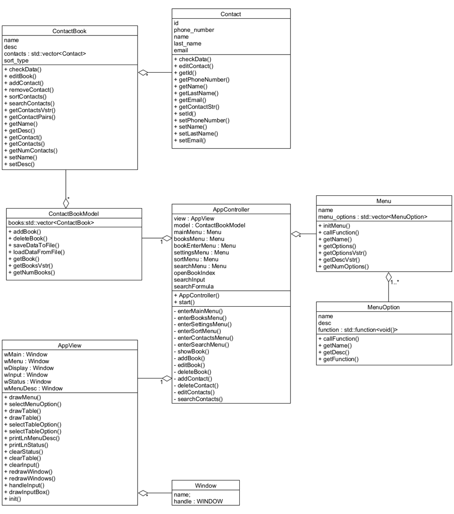
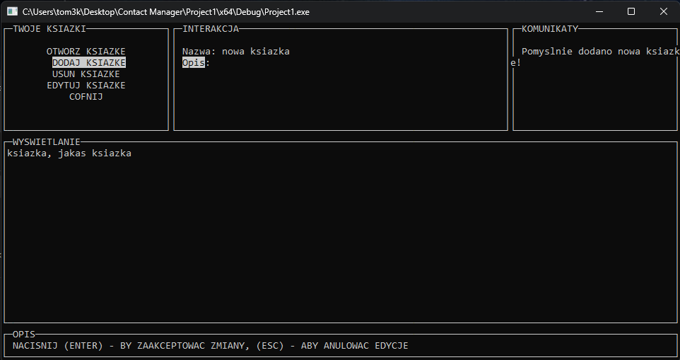
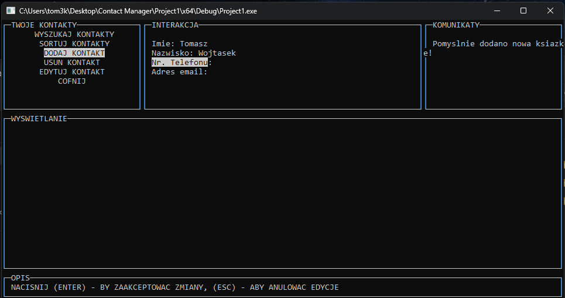

# Contact Manager

This is our simple project for university. The application is designed for managing contacts. 
Although the code contains some unimplemented functions and areas for optimization, our goal was to carefully plan the application's operations and provide proper documentation using [Doxygen](https://github.com/doxygen/doxygen).

The main objective of the application was to implement the MVC pattern, introduce a clear user interface, and develop appropriate algorithms to ensure that the project meets the requirements provided to the project group.

To create a graphical user interface, we used the [PDCurses](https://pdcurses.org/) library.

## UML Class Diagram

## User Interface

## Paper Documentation

[Paper Documentation (.pdf)](Paper_Docs.pdf)

Doxygen html documentation is located in the repository folder.

## Authors

- [Tomasz Wojtasek (link to github)](https://github.com/Zogir01)
- [Paweł Kurek (link to github)](https://github.com/PANP4W3L)
  
